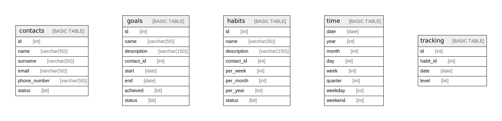

# tracking_habits

## Tables

| Name | Columns | Comment | Type |
| ---- | ------- | ------- | ---- |
| [contacts](contacts.md) | 6 |  | BASIC TABLE |
| [goals](goals.md) | 8 |  | BASIC TABLE |
| [habits](habits.md) | 8 |  | BASIC TABLE |
| [time](time.md) | 8 |  | BASIC TABLE |
| [tracking](tracking.md) | 4 |  | BASIC TABLE |

## Relations

---

> Generated by [tbls](https://github.com/k1LoW/tbls)
