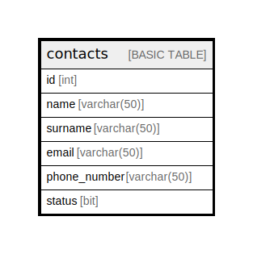

# contacts

## Description

## Columns

| Name | Type | Default | Nullable | Children | Parents | Comment |
| ---- | ---- | ------- | -------- | -------- | ------- | ------- |
| id | int |  | false |  |  |  |
| name | varchar(50) |  | false |  |  |  |
| surname | varchar(50) |  | false |  |  |  |
| email | varchar(50) |  | false |  |  |  |
| phone_number | varchar(50) |  | false |  |  |  |
| status | bit | ((1)) | false |  |  |  |

## Constraints

| Name | Type | Definition |
| ---- | ---- | ---------- |
| PK__contacts_* | PRIMARY KEY | CLUSTERED, unique, part of a PRIMARY KEY constraint, [ id ] |

## Indexes

| Name | Definition |
| ---- | ---------- |
| PK__contacts_* | CLUSTERED, unique, part of a PRIMARY KEY constraint, [ id ] |

## Relations

---

> Generated by [tbls](https://github.com/k1LoW/tbls)
