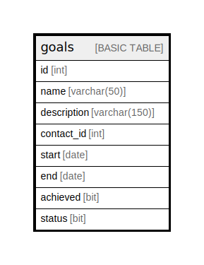

# goals

## Description

## Columns

| Name | Type | Default | Nullable | Children | Parents | Comment |
| ---- | ---- | ------- | -------- | -------- | ------- | ------- |
| id | int |  | false |  |  |  |
| name | varchar(50) |  | false |  |  |  |
| description | varchar(150) |  | false |  |  |  |
| contact_id | int |  | false |  |  |  |
| start | date |  | false |  |  |  |
| end | date |  | false |  |  |  |
| achieved | bit | ((0)) | false |  |  |  |
| status | bit | ((1)) | false |  |  |  |

## Constraints

| Name | Type | Definition |
| ---- | ---- | ---------- |
| PK__goals_* | PRIMARY KEY | CLUSTERED, unique, part of a PRIMARY KEY constraint, [ id ] |

## Indexes

| Name | Definition |
| ---- | ---------- |
| PK__goals_* | CLUSTERED, unique, part of a PRIMARY KEY constraint, [ id ] |

## Relations

---

> Generated by [tbls](https://github.com/k1LoW/tbls)
