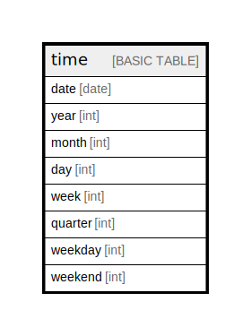

# time

## Description

## Columns

| Name | Type | Default | Nullable | Children | Parents | Comment |
| ---- | ---- | ------- | -------- | -------- | ------- | ------- |
| date | date |  | false |  |  |  |
| year | int |  | true |  |  |  |
| month | int |  | true |  |  |  |
| day | int |  | true |  |  |  |
| week | int |  | true |  |  |  |
| quarter | int |  | true |  |  |  |
| weekday | int |  | true |  |  |  |
| weekend | int |  | false |  |  |  |

## Relations

---

> Generated by [tbls](https://github.com/k1LoW/tbls)
